# Tipos de Contenido y Categorías en el CMS

## 📋 Tipos de Contenido (content_type)

El sistema soporta los siguientes tipos de contenido:

| Content Type | Descripción | Uso |
|--------------|-------------|-----|
| `post` | Post normal | Artículos estándar del blog |
| `post+` | Post mejorado | Artículos con características adicionales |
| `photo` | Fotografía | Posts centrados en imágenes |
| `quote` | Cita | Frases destacadas |
| `video-player` | Video Player | Videos embebidos (YouTube, etc.) |
| `music-player` | Music Player | Reproductores de música |
| `portfolio` | Portfolio | Proyectos de diseño/desarrollo |
| `debug` | Debug | Posts de prueba (solo visible en desarrollo) |

## 📁 Categorías (category)

Las categorías determinan en qué tab se muestra el post:

| Category | Tab Visible | Descripción |
|----------|-------------|-------------|
| `postsv2` | Concept | Posts normales y artículos |
| `portfolio` | Portfolio | Proyectos de portfolio |
| `about` | About | Página "Sobre mí" |

## 🎯 Reglas de Filtrado

### Tab "Concept" (Posts):
```typescript
// Muestra posts con:
category === 'postsv2' 
AND content_type !== 'portfolio'
AND content_type !== 'debug' (en producción)
```

**Posts que aparecen aquí**:
- Post normal (`post`)
- Post mejorado (`post+`)
- Photo
- Quote
- Video Player
- Music Player

### Tab "Portfolio":
```typescript
// Muestra posts con:
category === 'portfolio' 
OR content_type === 'portfolio'
```

**Posts que aparecen aquí**:
- Todos los proyectos de portfolio
- Posts con `category: 'portfolio'`
- Posts con `content_type: 'portfolio'`

### Tab "About":
```typescript
// Muestra posts con:
category === 'about'
```

## 📊 Distribución Actual

### Tab Concept (2 posts):
1. Post 42: "Non intrusive Music" (post)
2. Post 20: "Gamepads para teléfonos..." (post+)

### Tab Portfolio (15 posts):
1. Post 41: "YouFlix - Concept"
2. Post 40: "Windtoday - UI"
3. Post 39: "OpenKey - Branding"
4. Post 38: "University App - Concept"
5. Post 37: "Dain.App Redesign - Concept" ✅ Corregido
6. Post 36: "Read.cv Fork - Concept"
7. Post 35: "Portfolio redesign - Concept" ✅ Corregido
8. Post 34: "Savetech - Technical Test"
9. Post 33: "Humble Bundle - Technical Test"
10. Post 32: "Nuria Fernández - CV"
11. Post 31: "Pebbble - Concept" ✅ Corregido
12. Post 30: "Vape Shop - Concept"
13. Post 29: "Newsbot - Concept"
14. Post 28: "Name Up - Concept"
15. Post 27: "Leverade - Technical Test"

### Debug (4 posts - solo en dev):
1. Post 26: "Demo Portfolio Post"
2. Post 25: "Simplicity is the ultimate..."
3. Post 24: "Contenido Básico"
4. Post 23: "Otro Ejemplo Enriquecido"

## 🔧 Correcciones Realizadas

### Posts Corregidos (2025-10-11):

Los siguientes posts se corrigieron de `postsv2/post` a `portfolio/portfolio`:

1. **Post 31**: "Pebbble - Concept"
   - Antes: `category: postsv2, content_type: post`
   - Ahora: `category: portfolio, content_type: portfolio`

2. **Post 35**: "Portfolio redesign - Concept"
   - Antes: `category: postsv2, content_type: post`
   - Ahora: `category: portfolio, content_type: portfolio`

3. **Post 37**: "Dain.App Redesign - Concept"
   - Antes: `category: postsv2, content_type: post`
   - Ahora: `category: portfolio, content_type: portfolio`

**Razón**: Estos posts son proyectos de diseño/concepto y deben aparecer en la tab Portfolio, no en Concept.

## 🎨 Cómo Crear Posts para Cada Tab

### Para Tab "Concept":
```json
{
  "title": "Mi Artículo",
  "category": "postsv2",
  "content_type": "post",
  "published": true,
  "status": "published"
}
```

### Para Tab "Portfolio":
```json
{
  "title": "Mi Proyecto",
  "category": "portfolio",
  "content_type": "portfolio",
  "published": true,
  "status": "published"
}
```

### Para Posts de Debug (testing):
```json
{
  "title": "Test Post",
  "category": "postsv2",
  "content_type": "debug",
  "published": true,
  "status": "published"
}
```

## 🔍 Scripts Útiles

### Verificar distribución de posts:
```bash
npx tsx scripts/verify-post-distribution.ts
```

### Verificar posts específicos:
```bash
npx tsx scripts/check-portfolio-posts.ts
```

### Corregir posts de portfolio:
```bash
npx tsx scripts/fix-portfolio-concept-posts.ts
```

## 🐛 Solución de Problemas

### Un post no aparece en la tab correcta:

1. **Verificar en base de datos**:
   ```sql
   SELECT id, title, category, content_type, published, status
   FROM posts 
   WHERE id = {POST_ID};
   ```

2. **Para tab Concept**, debe tener:
   - `category = 'postsv2'`
   - `content_type != 'portfolio'`
   - `content_type != 'debug'` (en producción)

3. **Para tab Portfolio**, debe tener:
   - `category = 'portfolio'` O `content_type = 'portfolio'`

4. **Actualizar si es necesario**:
   ```sql
   UPDATE posts 
   SET 
     category = 'portfolio',
     content_type = 'portfolio'
   WHERE id = {POST_ID};
   ```

### Un post aparece en ambas tabs:

❌ **Esto NO debería pasar** con el filtrado actual.

Si sucede:
1. Verificar `category` y `content_type`
2. Limpiar caché del navegador
3. Verificar el código de filtrado en `posts-page-client.tsx`

## 📝 Mejores Prácticas

### ✅ Hacer:
- Usar `category: 'portfolio'` y `content_type: 'portfolio'` para proyectos
- Usar `category: 'postsv2'` y `content_type: 'post'` para artículos
- Usar `content_type: 'debug'` solo para testing
- Mantener consistencia entre `category` y `content_type`

### ❌ Evitar:
- Mezclar `category: 'postsv2'` con `content_type: 'portfolio'`
- Mezclar `category: 'portfolio'` con `content_type: 'post'`
- Usar `content_type: 'debug'` en producción
- Dejar campos NULL sin razón

## 🔄 Flujo de Publicación

```mermaid
graph TD
    A[Crear Post] --> B{¿Qué tipo?}
    
    B -->|Artículo/Post| C[category: postsv2]
    C --> D[content_type: post/post+/photo/etc]
    D --> E[Aparece en Tab Concept]
    
    B -->|Proyecto| F[category: portfolio]
    F --> G[content_type: portfolio]
    G --> H[Aparece en Tab Portfolio]
    
    B -->|Debug/Test| I[content_type: debug]
    I --> J[Solo visible en desarrollo]
```



---

**Fecha de actualización**: 2025-10-11  
**Versión**: 1.48.5  
**Estado**: ✅ Documentado y verificado

