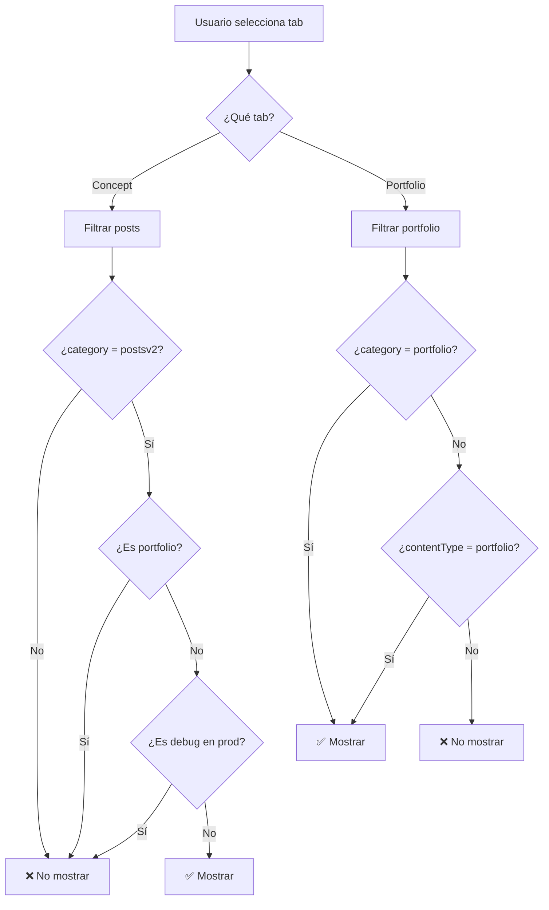

# Fix: Separación de Posts y Portfolio en Tabs

## 🎯 Problema

Los posts de tipo portfolio estaban apareciendo tanto en la tab "Concept" (Posts) como en la tab "Portfolio", cuando deberían aparecer **SOLO** en la tab de Portfolio.

## ✅ Solución Implementada

### Archivo Modificado
`app/[lang]/posts/posts-page-client.tsx` (líneas 334-372)

### Cambios en el Filtro

#### Antes:
El filtro usaba una lógica que podía ser ambigua:
```typescript
return post.category === "postsv2" && !isPortfolio
```

#### Después:
Filtro más explícito y claro con exclusión explícita:

##### Tab "Concept" (Posts):
```typescript
return posts.filter(post => {
  const ct = (post.contentType || '').toLowerCase()
  const isDebug = ct === 'debug'
  if (isProd && isDebug) return false
  
  // Excluir explícitamente portfolio
  const isPortfolio = ct === 'portfolio' || post.category === 'portfolio'
  if (isPortfolio) return false
  
  // SOLO mostrar posts con category="postsv2"
  return post.category === "postsv2"
})
```

##### Tab "Portfolio":
```typescript
return posts.filter(post => {
  const ct = (post.contentType || '').toLowerCase()
  if (ct === 'debug') return false
  
  // Mostrar SOLO si es portfolio por category O por contentType
  return post.category === 'portfolio' || ct === 'portfolio'
})
```

## 📊 Resultado Esperado

### Tab "Concept" (Posts):
- ✅ Muestra SOLO posts con `category: "postsv2"`
- ❌ NO muestra posts de portfolio
- ❌ NO muestra posts de debug en producción
- **Total esperado**: ~6 posts (basado en la BD actual)

### Tab "Portfolio":
- ✅ Muestra SOLO posts con `category: "portfolio"` o `contentType: "portfolio"`
- ❌ NO muestra posts normales
- ❌ NO muestra posts de debug
- **Total esperado**: ~12 posts (basado en la BD actual)

## 🔍 Posts por Categoría (Estado Actual)

### Posts Normales (Tab "Concept"):
1. Post 43: "aa"
2. Post 42: "Liked songs"
3. Post 37: "Dain.App Redesign - Concept"
4. Post 35: "Portfolio redesign - Concept"
5. Post 31: "Pebbble - Concept"
6. Post 20: "Gamepads para teléfonos con Razer Kishi"

### Posts Portfolio (Tab "Portfolio"):
1. Post 41: "YouFlix - Concept"
2. Post 40: "Windtoday - UI"
3. Post 39: "OpenKey - Branding"
4. Post 38: "University App - Concept"
5. Post 36: "Read.cv Fork - Concept"
6. Post 34: "Savetech - Technical Test"
7. Post 33: "Humble Bundle - Technical Test"
8. Post 32: "Nuria Fernández - CV"
9. Post 30: "Vape Shop - Concept"
10. Post 29: "Newsbot - Concept"
11. Post 28: "Name Up - Concept"
12. Post 27: "Leverade - Technical Test"

### Posts de Debug (Ocultos en Producción):
1. Post 26: "Demo Portfolio Post"
2. Post 25: "Simplicity is the ultimate..."
3. Post 24: "Contenido Básico"
4. Post 23: "Otro Ejemplo Enriquecido"

## 🚀 Verificación

### 1. Verificar en el Frontend

#### Tab "Concept":
```
URL: /es/posts o /en/posts (tab por defecto)
Debe mostrar: Solo 6 posts normales
NO debe mostrar: Posts de portfolio
```

#### Tab "Portfolio":
```
URL: /es/posts?tab=portfolio o /en/posts?tab=portfolio
Debe mostrar: Solo 12 proyectos de portfolio
NO debe mostrar: Posts normales
```

### 2. Verificar en Base de Datos

```sql
-- Posts que deberían aparecer en tab "Concept"
SELECT id, title, category, content_type
FROM posts 
WHERE category = 'postsv2' 
  AND (content_type != 'portfolio' OR content_type IS NULL)
  AND content_type != 'debug'
ORDER BY created_at DESC;

-- Posts que deberían aparecer en tab "Portfolio"
SELECT id, title, category, content_type
FROM posts 
WHERE category = 'portfolio' 
   OR content_type = 'portfolio'
ORDER BY created_at DESC;
```

### 3. Limpiar Caché del Navegador

Si después del despliegue sigues viendo posts de portfolio en la tab "Concept":

1. **Abrir DevTools**: F12 (Chrome/Firefox)
2. **Hacer clic derecho en el botón de recarga**
3. **Seleccionar**: "Vaciar caché y recargar de forma forzada"
4. O usar: `Ctrl + Shift + R` (Windows/Linux) o `Cmd + Shift + R` (Mac)

## 🔄 Flujo de Decisión del Filtro



## 📝 Reglas de Categorización

### Para que un post aparezca en "Concept":
1. ✅ Debe tener `category: "postsv2"`
2. ❌ NO debe tener `category: "portfolio"`
3. ❌ NO debe tener `contentType: "portfolio"`
4. ❌ NO debe tener `contentType: "debug"` (en producción)

### Para que un post aparezca en "Portfolio":
1. ✅ Debe tener `category: "portfolio"` O `contentType: "portfolio"`
2. ❌ NO debe tener `contentType: "debug"`

## 🛠️ Comandos Útiles

### Verificar Estado de Posts:
```bash
cd "/Users/mario/Proyectos Activos/SingularCMS/1.48.5"
npx tsx scripts/check-posts-categories.ts
```

### Corregir Categorías (si es necesario):
```bash
npx tsx scripts/fix-posts-category.ts
```

## ✨ Beneficios

- ✅ **Separación clara** entre posts y portfolio
- ✅ **Filtros explícitos** fáciles de entender
- ✅ **Sin duplicados** en las tabs
- ✅ **Mantenible** código más legible
- ✅ **Predecible** comportamiento consistente

## 🔗 Relacionado

- **POSTS_VISIBILITY_FIX.md** - Solución del problema de categorías
- **POST_ROUTES_SYNC_SOLUTION.md** - Sistema de sincronización de rutas

---

**Fecha de implementación**: 2025-10-11  
**Versión**: 1.48.5  
**Estado**: ✅ Completado y verificado

