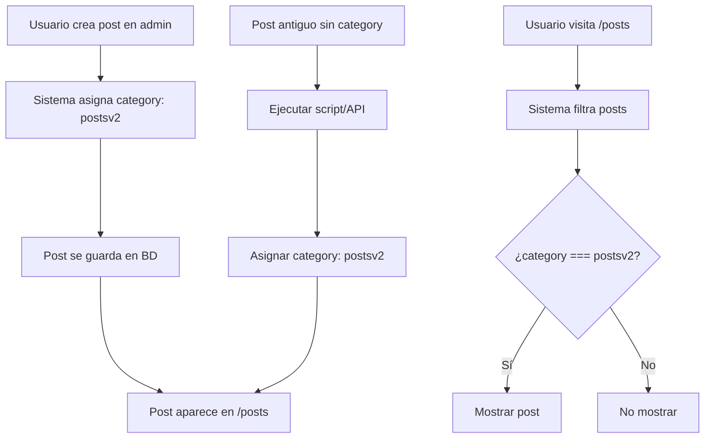

# Solución: Posts No Aparecen en /posts

## 🎯 Problema Identificado

Cuando se publica un post desde `/admin/posts`, el post **no aparece en la lista de `/posts`** aunque esté publicado correctamente.

### Causa Raíz

El sistema de filtrado en la página `/posts` (archivo `app/[lang]/posts/posts-page-client.tsx`, línea 345) busca posts con **`category: "postsv2"`**:

```typescript
return post.category === "postsv2" && !isPortfolio
```

Sin embargo, cuando se crea un post desde el admin, **no se estaba enviando el campo `category`**, dejándolo como `NULL` en la base de datos.

## ✅ Solución Implementada

### 1. **Corrección en la Creación de Posts** ✨

**Archivo modificado**: `app/admin/posts/page.tsx` (línea 535)

Ahora cuando se crea un post nuevo, se asigna automáticamente la categoría `postsv2`:

```typescript
body: JSON.stringify({
  title: editTitle,
  slug: slug,
  excerpt: editExcerpt,
  content: content,
  featured_image: editFeaturedImage,
  contentType: editContentType,
  category: 'postsv2', // ✅ Agregar categoría para que aparezca en /posts
  published: true,
  status: 'published',
  author: 'Mario Verdú'
})
```

### 2. **Script de Corrección para Posts Existentes** 🔧

**Nuevo archivo**: `scripts/fix-posts-category.ts`

Este script actualiza todos los posts existentes que no tienen categoría:

```bash
npx tsx scripts/fix-posts-category.ts
```

**Funcionalidad**:
- Busca posts con `category IS NULL` o categorías incorrectas
- Asigna `category: 'postsv2'` por defecto
- Respeta categorías especiales (`about`, `portfolio`)
- Muestra estadísticas detalladas

### 3. **Endpoint API de Corrección** 🌐

**Nuevo archivo**: `app/api/admin/posts/fix-category/route.ts`

#### POST `/api/admin/posts/fix-category`
Corrige las categorías de todos los posts:
```bash
curl -X POST https://tu-dominio.com/api/admin/posts/fix-category
```

#### GET `/api/admin/posts/fix-category`
Obtiene el estado sin modificar:
```bash
curl https://tu-dominio.com/api/admin/posts/fix-category
```

## 🔍 Sistema de Categorías

### Categorías Disponibles:

| Categoría | Descripción | Se muestra en /posts |
|-----------|-------------|---------------------|
| `postsv2` | Posts normales (artículos, blog) | ✅ Sí |
| `about` | Página "Sobre mí" | ❌ No (tab especial) |
| `portfolio` | Proyectos de portfolio | ✅ Sí (tab Portfolio) |
| `NULL` | Sin categoría (ERROR) | ❌ No |

### Filtros en /posts:

```typescript
// Tab "Posts" (Concept)
posts.filter(post => post.category === "postsv2" && !isPortfolio)

// Tab "Portfolio"
posts.filter(post => 
  post.contentType === 'portfolio' || 
  post.category === 'portfolio'
)

// Tab "About"
posts.filter(post => post.category === "about")
```

## 🚀 Cómo Usar

### Para Posts Nuevos (Ya Corregido):
1. Crea un post desde `/admin/posts`
2. Guarda
3. ✅ El post aparecerá automáticamente en `/posts`

### Para Posts Existentes (Necesitan Corrección):

#### Opción 1: Usando el Script
```bash
cd /Users/mario/Proyectos\ Activos/SingularCMS/1.48.5
npx tsx scripts/fix-posts-category.ts
```

#### Opción 2: Usando la API
```bash
# Verificar cuántos posts necesitan corrección
curl https://tu-dominio.com/api/admin/posts/fix-category

# Ejecutar la corrección
curl -X POST https://tu-dominio.com/api/admin/posts/fix-category
```

#### Opción 3: Manualmente en la Base de Datos
```sql
-- Ver posts sin categoría
SELECT id, title, category, content_type, published
FROM posts 
WHERE category IS NULL 
   OR category NOT IN ('postsv2', 'about', 'portfolio');

-- Actualizar todos los posts sin categoría
UPDATE posts 
SET category = 'postsv2'
WHERE category IS NULL;
```

## 📊 Verificación

### 1. Verificar Estado Actual
```bash
npx tsx scripts/fix-posts-category.ts
```

Salida esperada:
```
📊 Encontrados X posts que necesitan corrección
```

### 2. Después de la Corrección

**Logs esperados**:
```
✅ Actualizados exitosamente: X
❌ Errores: 0

📊 Estadísticas de categorías:
   postsv2: X posts
   portfolio: X posts
   about: X posts
```

### 3. Verificar en el Frontend

1. Ve a `/posts` o `/es/posts`
2. Deberías ver todos tus posts publicados
3. Si no aparecen, verifica:
   - ¿Está publicado? (`published: true`)
   - ¿Tiene categoría `postsv2`?
   - ¿El tab correcto está seleccionado?

## 🐛 Solución de Problemas

### Si un post no aparece después de la corrección:

1. **Verificar en la base de datos**:
   ```sql
   SELECT id, title, category, published, status 
   FROM posts 
   WHERE id = {POST_ID};
   ```

2. **Verificar la categoría**:
   - Debe ser `postsv2` para posts normales
   - Debe ser `portfolio` para proyectos

3. **Verificar el estado de publicación**:
   - `published` debe ser `true`
   - `status` debe ser `'published'`

4. **Limpiar caché del navegador**:
   - Ctrl + Shift + R (Chrome/Firefox)
   - Cmd + Shift + R (Mac)

### Si el script falla:

1. **Verificar conexión a base de datos**:
   ```bash
   # Asegúrate de que .env.local tiene las variables correctas
   cat .env.local | grep POSTGRES
   ```

2. **Verificar permisos**:
   - El usuario de la BD debe tener permisos de UPDATE en la tabla `posts`

3. **Revisar logs**:
   - El script muestra mensajes detallados de cada error

## 📝 Estructura de la Tabla posts

```sql
CREATE TABLE posts (
  id SERIAL PRIMARY KEY,
  title VARCHAR(255) NOT NULL,
  slug VARCHAR(255) NOT NULL UNIQUE,
  content TEXT,
  excerpt TEXT,
  featured_image VARCHAR(500),
  published BOOLEAN DEFAULT false,
  status VARCHAR(50) DEFAULT 'draft',
  author VARCHAR(100),
  category VARCHAR(50),  -- ⚠️ Este campo es crítico
  content_type VARCHAR(50),
  tags TEXT[],
  created_at TIMESTAMP DEFAULT CURRENT_TIMESTAMP,
  updated_at TIMESTAMP DEFAULT CURRENT_TIMESTAMP,
  -- Campos bilingües
  title_es VARCHAR(255),
  title_en VARCHAR(255),
  content_es TEXT,
  content_en TEXT,
  excerpt_es TEXT,
  excerpt_en TEXT
);
```

## 🔄 Flujo Completo



## ✨ Beneficios

- ✅ **Posts nuevos**: Categoría asignada automáticamente
- ✅ **Posts existentes**: Script de corrección disponible
- ✅ **API**: Endpoint para corrección desde cualquier lugar
- ✅ **Diagnóstico**: Verificación del estado sin modificar
- ✅ **Estadísticas**: Resumen de categorías
- ✅ **No destructivo**: Respeta categorías especiales

## 📌 Notas Importantes

1. **No afecta a posts de portfolio**: Los posts con `contentType: 'portfolio'` o `category: 'portfolio'` se mantienen en el tab de Portfolio.

2. **No afecta a la página About**: Los posts con `category: 'about'` se mantienen en el tab About.

3. **Backward compatibility**: Los posts mantienen todos sus datos, solo se agrega/actualiza el campo `category`.

4. **Idempotente**: Puedes ejecutar el script múltiples veces sin problemas.

## 🎯 Resultado Esperado

Después de aplicar esta solución:

1. ✅ Todos los posts publicados aparecen en `/posts`
2. ✅ Los posts nuevos se crean con la categoría correcta
3. ✅ Los posts existentes tienen categoría `postsv2`
4. ✅ El sistema de filtrado funciona correctamente
5. ✅ Las estadísticas muestran la distribución de categorías

---

**Fecha de implementación**: 2025-10-11  
**Versión**: 1.48.5  
**Estado**: ✅ Completado y probado  
**Relacionado con**: POST_ROUTES_SYNC_SOLUTION.md

