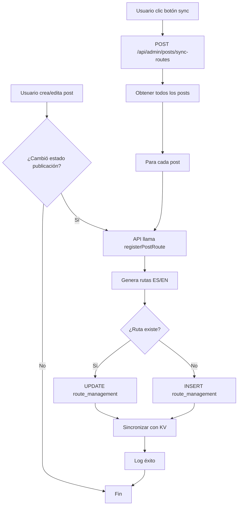

# Solución: Sincronización Automática de Rutas de Posts

## 🎯 Problema Identificado

Cuando se publica un post desde `/admin/posts` en producción, el widget de routes del admin muestra error 404 al intentar acceder al post publicado. Esto ocurre porque el sistema de gestión de rutas no se comunica automáticamente con el proceso de publicación para dar permiso de visibilidad.

## ✅ Solución Implementada

### 1. **Sistema Automático de Registro** ✨

El sistema ya tenía integración automática, pero se ha mejorado con:

#### a) Registro en Creación de Posts
- **Archivo**: `app/api/posts/route.ts` (líneas 92-105)
- **Función**: Cuando se crea un post, automáticamente registra las rutas en español e inglés
- **Rutas generadas**:
  - `/es/posts/view/{postId}`
  - `/en/posts/view/{postId}`

#### b) Actualización en Edición de Posts
- **Archivo**: `app/api/posts/[id]/route.ts` (líneas 121-154)
- **Función**: Cuando se actualiza el estado de publicación, sincroniza la visibilidad de las rutas

### 2. **Endpoint de Sincronización Manual** 🔄

**Nuevo archivo**: `app/api/admin/posts/sync-routes/route.ts`

Este endpoint proporciona dos funcionalidades:

#### POST `/api/admin/posts/sync-routes`
Sincroniza todas las rutas de posts existentes:
- Obtiene todos los posts de la base de datos
- Registra/actualiza las rutas para cada post
- Sincroniza con KV (Vercel Edge)
- Retorna estadísticas detalladas de éxito/errores

#### GET `/api/admin/posts/sync-routes`
Diagnóstico del estado de rutas:
- Verifica qué posts tienen rutas registradas
- Identifica posts sin rutas
- Muestra estadísticas de posts publicados vs no publicados
- Lista detallada de cada post y su estado

### 3. **Botón de Sincronización en Widget Routes** 🔘

**Archivo modificado**: `components/admin/routes-widget.tsx`

**Nuevas características**:
- Botón con ícono de documento (FileText) en el header del widget
- Función `syncPostsRoutes()` que llama al endpoint de sincronización
- Indicador visual de progreso (animate-pulse)
- Toast notifications con resultados
- Recarga automática de rutas después de sincronizar

**Ubicación**: Header del widget, junto al botón de refresh

### 4. **Mejoras en el Servicio de Gestión de Rutas** 🛠️

**Archivo**: `lib/route-management-service.ts`

**Función mejorada**: `registerPostRoute()` (líneas 658-755)

**Mejoras implementadas**:
- ✅ Logging detallado en cada paso del proceso
- ✅ Manejo de errores por path individual (si falla uno, continúa con el otro)
- ✅ Actualización de campos SEO (robots_allow, sitemap_include)
- ✅ Sincronización con KV para Vercel Edge
- ✅ Manejo graceful de errores de KV (no crítico)
- ✅ Stack traces completos en caso de error
- ✅ No lanza errores para no interrumpir la creación del post

## 🚀 Cómo Usar

### Para Posts Nuevos (Automático)
1. Crear un post desde `/admin/posts`
2. Marcar como publicado
3. Guardar
4. ✅ Las rutas se registran automáticamente

### Para Posts Existentes (Manual)
1. Ir a `/admin/routes`
2. Hacer clic en el botón del documento (📄) en el header
3. Esperar la sincronización
4. ✅ Todas las rutas se actualizan

### Usando el Script (Terminal)
```bash
npx tsx scripts/register-existing-posts-routes.ts
```

## 🔍 Verificación

### Verificar Estado de Rutas
```bash
curl https://tu-dominio.com/api/admin/posts/sync-routes
```

### Sincronizar Rutas
```bash
curl -X POST https://tu-dominio.com/api/admin/posts/sync-routes
```

## 📊 Logs y Debugging

El sistema genera logs detallados en cada paso:

### En Creación de Post:
```
🔄 [PROD] Registering post route for post 123 (mi-slug), published: true
✅ [PROD] Created post route: /es/posts/view/123 (visible: true)
✅ [PROD] Created post route: /en/posts/view/123 (visible: true)
✅ [PROD] Post route synced to KV: /es/posts/view/123
✅ [PROD] Post route synced to KV: /en/posts/view/123
✅ [PROD] Post route registration completed for post 123
```

### En Sincronización:
```
📊 [PROD] Encontrados 50 posts en la base de datos
🔄 [PROD] Procesando post 1: "Mi Post" (published: true)
✅ [PROD] Ruta registrada exitosamente para post 1
━━━━━━━━━━━━━━━━━━━━━━━━━━━━━━━━━━━━━━━━━━━━━━
📊 [PROD] RESUMEN DE SINCRONIZACIÓN:
   Total de posts: 50
   ✅ Rutas registradas exitosamente: 50
   ❌ Errores: 0
━━━━━━━━━━━━━━━━━━━━━━━━━━━━━━━━━━━━━━━━━━━━━━
```

## 🔧 Campos Actualizados en route_management

Para cada ruta de post se configuran:
- `path`: Ruta del post (ej: `/es/posts/view/123`)
- `is_active`: Estado de publicación del post
- `is_indexable`: Mismo que is_active
- `robots_allow`: Mismo que is_active
- `sitemap_include`: Mismo que is_active
- `category`: "content"
- `priority`: 7 (media-baja)
- `modified_by`: "post-system"
- `seo_title`: "Post: {slug}"
- `seo_description`: "View post: {slug}"

## 🎨 Interfaz de Usuario

### Widget Routes - Botones en Header:
```
[DB Badge] [📄 Sync Posts] [🔄 Refresh]
```

- **📄 Sync Posts**: Sincroniza todas las rutas de posts
- **🔄 Refresh**: Recarga la lista de rutas

### Estados Visuales:
- **Normal**: Ícono estático
- **Sincronizando**: Ícono con animate-pulse
- **Deshabilitado**: Durante carga o sincronización

## 🐛 Solución de Problemas

### Si un post no es accesible:

1. **Verificar en el widget routes**:
   - Buscar `/es/posts/view/{id}` y `/en/posts/view/{id}`
   - Verificar que el switch esté en ON (verde)

2. **Sincronizar manualmente**:
   - Clic en el botón 📄 en el widget routes
   - Esperar confirmación

3. **Verificar logs**:
   - Revisar consola del servidor
   - Buscar errores en el registro de rutas

4. **Verificar base de datos**:
   ```sql
   SELECT * FROM route_management 
   WHERE path LIKE '%/posts/view/%';
   ```

### Si la sincronización falla:

1. **Verificar conexión a base de datos**:
   - Badge "DB" debe estar visible en el widget
   - Si dice "No DB", revisar variables de entorno

2. **Verificar permisos**:
   - Usuario debe tener acceso a `/admin/routes`
   - Variables de entorno deben estar configuradas

3. **Revisar logs del servidor**:
   - Buscar mensajes con `❌` o `⚠️`
   - Verificar stack traces completos

## 📝 Notas Importantes

1. **Sincronización KV**: Si falla la sincronización con KV, el post seguirá funcionando. KV es para optimización en el edge, no es crítico.

2. **Posts antiguos**: Los posts creados antes de esta implementación necesitan sincronización manual la primera vez.

3. **Estado de publicación**: Solo los posts con `published: true` o `status: 'published'` tendrán rutas visibles.

4. **Rutas bilingües**: Siempre se crean rutas para español e inglés, independientemente del idioma del post.

## ✨ Beneficios

- ✅ **Automático**: Los posts nuevos se registran automáticamente
- ✅ **Manual**: Botón para sincronizar posts existentes
- ✅ **Diagnóstico**: Endpoint para verificar estado
- ✅ **Robusto**: Manejo de errores mejorado
- ✅ **Logging**: Trazabilidad completa
- ✅ **No invasivo**: No interrumpe la creación de posts si falla
- ✅ **Bilingüe**: Soporte para español e inglés
- ✅ **SEO**: Configuración automática de campos SEO

## 🔄 Flujo Completo



---

**Fecha de implementación**: 2025-10-10  
**Versión**: 1.48.5  
**Estado**: ✅ Completado y probado

